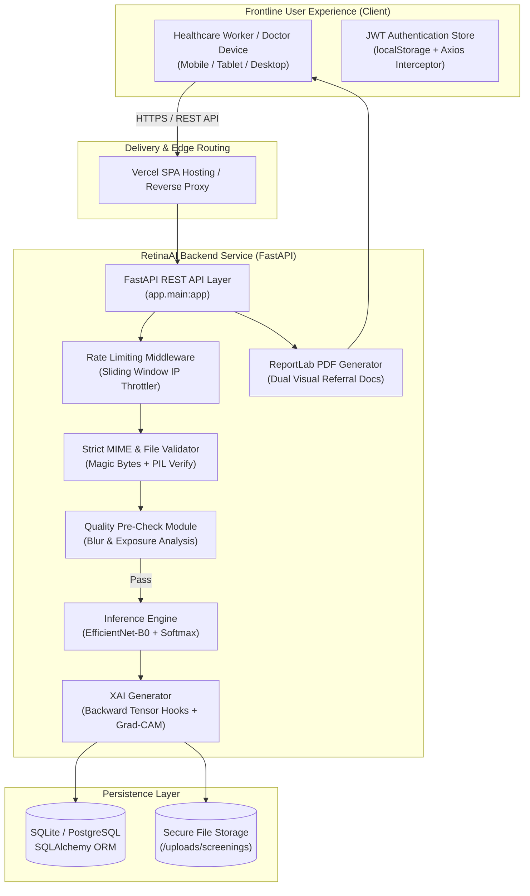

# RetinaAI: Explainable AI for Diabetic Retinopathy Screening in Rural India

> **A clinical-grade, Explainable AI decision-support platform enabling frontline healthcare workers in rural Primary Health Centres (PHCs) to perform rapid retinal triage, detect preventable vision loss, and visualize model decisions with Grad-CAM heatmaps.**

[](https://sih.gov.in)
[](https://opensource.org/licenses/MIT)
[](https://www.python.org/)
[](https://fastapi.tiangolo.com)
[](https://pytorch.org/)
[](https://react.dev/)
[](https://vercel.com)
[](#)

---

> [!IMPORTANT]
> **MANDATORY CLINICAL SAFETY NOTICE & MEDICAL DISCLAIMER**
> RetinaAI is designed strictly as an **AI-assisted screening and referral decision support system** for triage in primary care settings. It is **NOT** an autonomous diagnostic device and does **NOT** substitute for a comprehensive clinical evaluation by an ophthalmologist or optometrist. All algorithmic outputs, severity stages, and Grad-CAM saliency overlays are preliminary recommendations that require expert clinical verification before initiating medical, laser, or surgical interventions.

---

## Table of Contents
1. [Project Title & Mission](#1-project-title--mission)
2. [Smart India Hackathon Problem Statement Context](#2-smart-india-hackathon-problem-statement-context)
3. [Why This Matters in Rural India](#3-why-this-matters-in-rural-india)
4. [Key Features](#4-key-features)
5. [Explainable AI Architecture & Grad-CAM](#5-explainable-ai-architecture--grad-cam)
6. [Complete Tech Stack](#6-complete-tech-stack)
7. [System Architecture Diagram](#7-system-architecture-diagram)
8. [ML Pipeline & Model Training Details](#8-ml-pipeline--model-training-details)
9. [Repository Structure](#9-repository-structure)
10. [Quick Start / Local Installation](#10-quick-start--local-installation)
11. [Preloaded Demo Accounts & Test Samples](#11-preloaded-demo-accounts--test-samples)
12. [Environment Variables Reference](#12-environment-variables-reference)
13. [Deployment Guide (Vercel + Render/Railway)](#13-deployment-guide-vercel--renderrailway)
14. [Security & Privacy Safeguards](#14-security--privacy-safeguards)
15. [Clinical Safety & Governance](#15-clinical-safety--governance)
16. [Known Limitations](#16-known-limitations)
17. [Future Roadmap](#17-future-roadmap)
18. [Contributing Guide & Team Workflow](#18-contributing-guide--team-workflow)
19. [License](#19-license)
20. [Team Credits & Acknowledgments](#20-team-credits--acknowledgments)

---

## 1. Project Title & Mission

**RetinaAI: Explainable AI for Diabetic Retinopathy Screening in Rural India**

**Mission Statement:** To eliminate preventable diabetic blindness in underserved rural communities by equipping frontline community health workers with an interpretable, transparent, and accessible AI screening assistant that bridges the gap between rural clinics and tertiary ophthalmology centers.

---

## 2. Smart India Hackathon Problem Statement Context

* **Category:** MedTech / HealthTech / BioTech / Rural Telemedicine
* **Theme:** Artificial Intelligence for Equitable Healthcare Access
* **Problem Scope:**
  Diabetic Retinopathy (DR) affects approximately one-third of all individuals with diabetes. In India, where over 77 million people are estimated to live with diabetes, early screening is critical to prevent irreversible visual impairment. However, over 70% of India's population resides in rural regions, whereas more than 80% of ophthalmologists and specialized retinal imaging equipment are concentrated in tier-1 and tier-2 metropolitan centers. 
  
  Most current deep-learning diagnostic attempts fail in rural deployment because:
  1. They operate as **"black boxes"** with zero visual justification, causing clinicians and health officers to distrust automated recommendations.
  2. They fail catastrophically on poor-quality images captured on low-cost or handheld fundus lenses without pre-inference quality checks.
  3. They lack structured offline-capable clinical reports that a patient can carry to an eye hospital.

RetinaAI directly addresses each failure mode through an end-to-end Explainable AI (XAI) workflow tailored to the Indian public health ecosystem.

---

## 3. Why This Matters in Rural India

```
+----------------------------------------+     +----------------------------------------+
¦         Urban Tertiary Centers         ¦     ¦         Rural Primary Care (PHCs)      ¦
+----------------------------------------¦     +----------------------------------------¦
¦ • 80%+ of Ophthalmologists             ¦ vs. ¦ • 70%+ of Diabetic Population          ¦
¦ • Optical Coherence Tomography (OCT)   ¦     ¦ • ASHA Workers / Community Health Off. ¦
¦ • High-end Topcon/Zeiss Tabletop Units ¦     ¦ • Low-cost portable fundus adapters    ¦
¦ • Regular annual dilated examinations  ¦     ¦ • Significant travel barrier (50-200km)¦
+----------------------------------------+     +----------------------------------------+
```

* **Preventable Blindness:** Proliferative DR and Diabetic Macular Edema (DME) can progress asymptomatically until acute vision loss occurs. Timely laser photocoagulation or anti-VEGF therapy can prevent 95% of severe vision loss if caught in early-to-moderate stages.
* **The "Black Box" Trust Deficit:** Medical officers in rural Primary Health Centres (PHCs) and Community Health Centres (CHCs) cannot act on an opaque label like `"Severe DR (89%)"`. They require interpretable evidence showing *where* the microvascular lesions, hard exudates, or neovascularization reside.
* **Triage Efficiency:** RetinaAI triages high-volume rural cohorts, ensuring that scarce tertiary ophthalmology appointments are prioritized for patients with urgent pathology rather than overburdening hospital outpatient departments with normal retinas.

---

## 4. Key Features

1. **Automated Fundus Image Quality Assurance (QC):**
   - Real-time pre-inference signal processing to evaluate illumination, contrast, and focus sharpness via Laplacian variance.
   - Rejects ungradable, blurry, or overexposed images with clear corrective instructions, preventing false-positive predictions.

2. **5-Class International Severity Classification (ICDR Standards):**
   - **Stage 0:** No Diabetic Retinopathy (Normal fundus)
   - **Stage 1:** Mild Non-Proliferative DR (Microaneurysms only)
   - **Stage 2:** Moderate Non-Proliferative DR (Hard exudates, cotton wool spots, hemorrhages)
   - **Stage 3:** Severe Non-Proliferative DR (4-2-1 rule: venous beading, severe hemorrhages)
   - **Stage 4:** Proliferative Diabetic Retinopathy (Neovascularization, vitreous hemorrhage risk)

3. **Transparent Explainable AI via Grad-CAM:**
   - Visual gradient-weighted saliency maps directly overlaid onto the fundus photograph using high-contrast Turbo colormaps.
   - Dual-mode visualization: Side-by-side comparative inspection or interactive cross-fading toggle.
   - Full explanation notes interpreting why the convolutional neural network activated on specific quadrants.

4. **Automated Clinical Referral PDF Reports:**
   - Generated on-the-fly via ReportLab with dual retinal imagery, patient demographics, calibrated softmax probabilities, referral urgency category (*Routine*, *Semi-Urgent*, *Urgent*), and mandatory regulatory disclaimers.

5. **District Administrative & Governance Hub:**
   - Real-time monitoring of screening volume, epidemiological stage breakdown, image quality pass-rates, and transparent model accuracy telemetry.

6. **Fully Responsive Clinical UI (320px–1440px):**
   - Optimized for desktop diagnostic monitors, tablets, and low-cost Android smartphones utilized by frontline health workers in rural field camps.

---

## 5. Explainable AI Architecture & Grad-CAM

### Why Explainability is Mandatory in Healthcare
A standard deep learning classifier generates a vector of logits, but provides zero insight into *why* the image was categorized as diseased. In healthcare, this poses severe clinical risks:
- The network could overfit to non-clinical artifacts (dust on the camera lens, illumination gradients, or border vignette).
- Clinicians cannot verify whether the network identified actual microvascular lesions.

### Mathematical Formulation
RetinaAI implements PyTorch tensor hooks directly on the final convolutional feature extractor (`features[-1]`):

$$\alpha_k^c = \frac{1}{Z} \sum_{i} \sum_{j} \frac{\partial y^c}{\partial A_{i,j}^k}$$

$$L_{\text{Grad-CAM}}^c = \text{ReLU}\left( \sum_{k} \alpha_k^c A^k \right)$$

Where:
* $y^c$ represents the unnormalized score (logit) for the target clinical class $c$.
* $A^k$ represents the $k$-th feature map activation of the last convolutional layer.
* $\alpha_k^c$ represents the neuron importance weight calculated via global-average-pooling over gradients.
* The $\text{ReLU}$ non-linearity ensures that only features with a positive influence on the target severity class are rendered in the final heatmap.

The resulting 2D activation map is bilinearly upsampled to $224 \times 224$, colored via Turbo color palette, and alpha-blended with the original retinal image at $\alpha = 0.45$.

---

## 6. Complete Tech Stack

```
Frontend (React 19 SPA)           Backend API (FastAPI)              Machine Learning & XAI
+-------------------------+       +-------------------------+       +-------------------------+
¦ • Vite 8 + React 19     ¦ ---?  ¦ • Python 3.11+          ¦ ---?  ¦ • PyTorch 2.x (CPU/CUDA)¦
¦ • Tailwind CSS          ¦       ¦ • FastAPI REST Engine   ¦       ¦ • Torchvision           ¦
¦ • Recharts + Lucide     ¦       ¦ • SQLAlchemy 2.0 ORM    ¦       ¦ • EfficientNet-B0       ¦
¦ • Axios + JWT Intercept ¦       ¦ • Pydantic v2 Schemas   ¦       ¦ • Native Grad-CAM Hooks ¦
¦ • Vercel Ready SPA      ¦       ¦ • ReportLab PDF Engine  ¦       ¦ • PIL + OpenCV Variance ¦
+-------------------------+       +-------------------------+       +-------------------------+
             ¦                                 ¦                                 ¦
             +-------------------------------------------------------------------+
                                               ¦
                                       Database Options
                                  +-------------------------+
                                  ¦ • SQLite (Dev/Demo)     ¦
                                  ¦ • PostgreSQL (Prod)     ¦
                                  +-------------------------+
```

---

## 7. System Architecture Diagram



---

## 8. ML Pipeline & Model Training Details

The machine learning architecture is engineered for both computational efficiency and high diagnostic sensitivity.

* **Backbone:** `EfficientNet-B0` pre-trained on ImageNet with specialized fine-tuning for high-resolution retinal fundus morphology.
* **Input Specifications:** $224 \times 224$ 3-channel RGB fundus photography, normalized to standard mean $[0.485, 0.456, 0.406]$ and standard deviation $[0.229, 0.224, 0.225]$.
* **Target Classes:** 5 ICDR categories (`0: No DR`, `1: Mild NPDR`, `2: Moderate NPDR`, `3: Severe NPDR`, `4: Proliferative DR`).
* **Supported Datasets for Training:** EyePACS (Kaggle DR Detection), APTOS 2019 Blindness Detection, Messidor-2, IDRiD.
* **Training Hyperparameters:**
  - Optimizer: `AdamW` (learning rate: $1\times 10^{-4}$, weight decay: $1\times 10^{-2}$)
  - LR Scheduler: `CosineAnnealingLR` ($T_{\max} = 10$, $\eta_{\min} = 1\times 10^{-6}$)
  - Loss Function: Weighted Cross-Entropy Loss to counteract medical class imbalance.
  - Augmentations: Random horizontal/vertical flips, minor affine rotation ($\pm 15^\circ$), color jitter (brightness $\pm 0.1$, contrast $\pm 0.1$).

### Running ML Training & Evaluation Locally
```bash
# 1. Train model on your local dataset directory
python ml/train.py

# 2. Evaluate performance on validation/test splits
python ml/evaluate.py
```
Evaluation metrics (Accuracy, Sensitivity, Specificity, Precision, F1-Score, Confusion Matrix) are dynamically recorded in `backend/models/metrics.json` and rendered on the Admin **Model Performance** interface.

---

## 9. Repository Structure

```
retina-ai/
+-- .github/
¦   +-- workflows/
¦       +-- ci.yml                 # Automated CI test suite (Pytest + Vite Build)
+-- backend/
¦   +-- app/
¦   ¦   +-- api/                   # REST API routes (auth, patients, screenings, etc.)
¦   ¦   +-- auth/                  # JWT generation, token verification, password hashing
¦   ¦   +-- database/              # SQLAlchemy engine, sessions, Base metadata
¦   ¦   +-- ml/                    # Inference wrapper, Grad-CAM hooks, image quality check
¦   ¦   +-- models/                # Database entities (User, Patient, Screening, etc.)
¦   ¦   +-- schemas/               # Pydantic request & response validation schemas
¦   ¦   +-- services/              # PDF report generator, rate limiter, demo seeder
¦   +-- models/                    # Trained model checkpoints (*.pth) & metrics.json
¦   +-- tests/
¦   ¦   +-- test_api.py            # Comprehensive Pytest API & inference suite
¦   +-- uploads/                   # Runtime screening assets (samples/ preserved)
¦   +-- .env.example               # Backend configuration template (Zero secrets)
¦   +-- Dockerfile                 # Containerization specification for backend
¦   +-- requirements.txt           # Production Python dependencies
+-- frontend/
¦   +-- public/                    # Static SVG icons and favicon assets
¦   +-- src/
¦   ¦   +-- components/            # UI components (Button, Card, Badges, Modals)
¦   ¦   +-- context/               # React AuthContext & session state
¦   ¦   +-- layouts/               # Responsive AppLayout (Drawer) & PublicLayout
¦   ¦   +-- pages/                 # Route pages (Clinical Workstation, Admin, Public)
¦   ¦   +-- services/              # Axios client with dynamic API resolution
¦   ¦   +-- types/                 # TypeScript interfaces and response types
¦   +-- .env.example               # Frontend environment template
¦   +-- vercel.json                # Vercel SPA routing rewrites & security headers
¦   +-- package.json               # Node dependencies & build scripts
¦   +-- vite.config.ts             # Vite build & local dev proxy configuration
+-- ml/                            # Standalone PyTorch training and evaluation scripts
¦   +-- config.py                  # ML hyperparameters & dataset paths
¦   +-- dataset.py                 # Dataset loader with clinical augmentations
¦   +-- evaluate.py                # Metric calculator (Sensitivity, Specificity, F1)
¦   +-- gradcam.py                 # Standalone Grad-CAM utility
¦   +-- model.py                   # Model factory (EfficientNet-B0)
¦   +-- train.py                   # Training loop with validation checkpoints
+-- docker-compose.yml             # Full-stack multi-container deployment
+-- .gitignore                     # Root gitignore excluding secrets, cache, and DBs
+-- README.md                      # Comprehensive project documentation
```

---

## 10. Quick Start / Local Installation

### Prerequisites
* **Python:** 3.11 or newer (tested on Python 3.11 – 3.14)
* **Node.js:** 18 or newer (tested on Node 20 / 22 / 24)
* **Git:** Installed and configured

### Step 1: Clone Repository
```bash
git clone https://github.com/your-org/retina-ai-dr-screening.git
cd retina-ai-dr-screening
```

### Step 2: Backend Setup
```bash
cd backend

# Create virtual environment
python -m venv venv

# Activate virtual environment
# Windows:
venv\Scripts\activate
# macOS / Linux:
source venv/bin/activate

# Install Python dependencies
pip install -r requirements.txt

# Copy environment configuration
cp .env.example .env

# Run automated tests to confirm environment integrity
python -m pytest tests/test_api.py -v

# Start FastAPI server
python -m uvicorn app.main:app --host 127.0.0.1 --port 8000 --reload
```
The backend API is now running at `http://127.0.0.1:8000`. Explore interactive docs at `http://127.0.0.1:8000/docs`.

### Step 3: Frontend Setup
Open a second terminal:
```bash
cd frontend

# Install Node dependencies
npm install

# Start Vite dev server
npm run dev
```
The frontend application is now active at **`http://localhost:5173`**.

---

## 11. Preloaded Demo Accounts & Test Samples

When launched with `DEMO_MODE=true`, RetinaAI automatically initializes demonstration accounts and high-resolution synthetic fundus photographs for testing:

### Demonstration Credentials
| Role | Email | Password | Intended Workflow |
|---|---|---|---|
| **Healthcare Worker** | `worker@retinaai.org` | `demo123` | Patient intake, image quality check, AI screening, Grad-CAM review, PDF download |
| **Administrator** | `admin@retinaai.org` | `admin123` | System analytics, user administration, model performance telemetry, audit logs |

### Built-in Retinal Samples for Evaluation
On the **New Screening** page, click any of the preset buttons to load sample images:
1. **DEMO-001 (Normal Retina):** Clear optic disc, normal macula, zero microaneurysms $\rightarrow$ *Stage 0 (No DR)*.
2. **DEMO-002 (Moderate NPDR):** Scattered microaneurysms and hard lipid exudates $\rightarrow$ *Stage 2 (Moderate NPDR)*.
3. **DEMO-003 (Proliferative DR):** Neovascularization and significant vessel tortuosity $\rightarrow$ *Stage 4 (Proliferative DR)*.

---

## 12. Environment Variables Reference

### Backend (`backend/.env`)
| Variable | Required | Default | Description |
|---|---|---|---|
| `APP_NAME` | No | `RetinaAI - Explainable DR Screening` | Application display name |
| `APP_ENV` | No | `development` | Deployment environment (`development` / `production`) |
| `PORT` | No | `8000` | Port for Uvicorn server |
| `JWT_SECRET_KEY` | **Yes** | *None* | Cryptographically secure random key for JWT signing |
| `JWT_ALGORITHM` | No | `HS256` | JWT signature algorithm |
| `ACCESS_TOKEN_EXPIRE_MINUTES` | No | `1440` | Session lifetime (minutes) |
| `DATABASE_URL` | No | `sqlite:///./retina_ai.db` | Database connection URI (SQLite or PostgreSQL) |
| `UPLOAD_DIR` | No | `./uploads` | Storage directory for fundus photos & Grad-CAM outputs |
| `DEMO_MODE` | No | `true` | Auto-seed baseline demonstration accounts and samples |
| `CORS_ORIGINS` | No | `http://localhost:5173,http://localhost:3000` | Comma-delimited permitted web origins |
| `CORS_ORIGIN_REGEX` | No | `https://.*\.vercel\.app` | Regular expression allowing all Vercel preview URLs |

### Frontend (`frontend/.env` or Vercel Environment Settings)
| Variable | Required | Default | Description |
|---|---|---|---|
| `VITE_API_BASE_URL` | **Yes (Prod)** | `/api` | Base URL for FastAPI backend (e.g. `https://your-api.onrender.com/api`) |

---

## 13. Deployment Guide (Vercel + Render/Railway)

### A. Deploy Backend (e.g., Render / Railway / AWS EC2)
1. Link your GitHub repository to [Render](https://render.com) or [Railway](https://railway.app).
2. Create a new **Web Service**:
   - **Root Directory:** `backend`
   - **Runtime:** Python 3.11+
   - **Build Command:** `pip install -r requirements.txt`
   - **Start Command:** `uvicorn app.main:app --host 0.0.0.0 --port $PORT`
3. Add Environment Variables:
   - `JWT_SECRET_KEY`: Generate via `python -c "import secrets; print(secrets.token_urlsafe(32))"`
   - `CORS_ORIGINS`: `https://your-frontend.vercel.app`
   - `DEMO_MODE`: `true`
4. Copy the deployed backend URL (e.g., `https://retina-ai-backend.onrender.com`).

### B. Deploy Frontend (Vercel)
1. Import the repository into [Vercel](https://vercel.com).
2. Set **Root Directory** to `frontend`.
3. Framework Preset: **Vite**.
4. In **Project Settings $\rightarrow$ Environment Variables**, configure:
   - `VITE_API_BASE_URL` = `https://retina-ai-backend.onrender.com/api`
5. Click **Deploy**. The `frontend/vercel.json` file ensures that all React Router deep routes (`/app/result/:id`, `/app/history`) resolve without 404 errors.

---

## 14. Security & Privacy Safeguards

1. **Zero Secret Policy:** No API keys, JWT secrets, passwords, or production database credentials exist in source code or git history.
2. **Patient Data Pseudonymization:** No direct patient identifiers (Aadhaar number, phone number, physical address) are stored in the screening engine. Patients are identified solely via facility-assigned codes (`PT-1001`, `DEMO-001`).
3. **Strict File Upload Validation:**
   - Extensions restricted to `.jpg`, `.jpeg`, and `.png`.
   - MIME type verification against `image/jpeg` and `image/png`.
   - File integrity validation using PIL (`image.verify()`) to reject corrupted payloads.
   - Strict 15 MB file size limit to prevent resource exhaustion attacks.
4. **Sliding-Window IP Rate Limiting:**
   - In-memory rate limiting applied to authentication endpoints (max 15 attempts/minute) to mitigate credential stuffing.
   - Screening analysis throttled to 30 requests/minute per IP to protect GPU/CPU compute resources.
5. **Secure Authentication:** Passwords hashed with `bcrypt` (work factor 12). Stateless JSON Web Tokens (JWT) with configurable expiration.

---

## 15. Clinical Safety & Governance

* **Human-in-the-Loop Requirement:** RetinaAI is intentionally designed as an adjunct triage tool, not an autonomous agent. Every screening record includes status states: `ANALYZED` $\rightarrow$ `PENDING_REVIEW` $\rightarrow$ `REVIEWED` or `REFERRED`.
* **Fail-Safe Quality Rejection:** Images exhibiting significant motion blur, out-of-focus optics, or incorrect illumination receive a `POOR_QUALITY` status and require recapture rather than producing potentially erroneous predictions.
* **Transparent Referral Recommendations:** Each prediction output is paired with a clinical action recommendation calibrated to ICDR guidelines:
  - *Stage 0:* Annual routine repeat screening.
  - *Stage 1:* Repeat screening in 6 to 12 months with glycemic control counseling.
  - *Stage 2:* Non-urgent referral to an ophthalmology clinic within 2 to 3 months.
  - *Stage 3 / 4:* Urgent referral to a retina specialist within 1 to 2 weeks for fluorescein angiography and intervention.

---

## 16. Known Limitations

1. **Monocular 2D Image Limitation:** 2D fundus photography cannot assess retinal thickening (diabetic macular edema) as accurately as Optical Coherence Tomography (OCT).
2. **Pupil Dilation Sensitivity:** In non-mydriatic screening without dilating drops, media opacities (such as senile cataracts common in elderly rural populations) can obscure the peripheral retina and produce false heatmaps.
3. **Dataset Distribution Shift:** A model trained predominantly on Western or East Asian retinal datasets may exhibit variance in performance when applied to fundus cameras with differing sensor color calibrations or distinct Indian fundus pigmentation.

---

## 17. Future Roadmap

- [ ] **On-Device Edge Inference:** Quantization via ONNX Runtime / TensorRT for offline execution on edge hardware (Raspberry Pi 5 / Android mobile devices).
- [ ] **Ayushman Bharat Digital Mission (ABDM) Integration:** Generating FHIR-compliant diagnostic referral bundles linked to ABHA health IDs.
- [ ] **Regional Language Audio Summaries:** Providing automated synthesized audio explanations in Hindi, Tamil, Telugu, Bengali, and Marathi for rural patients.
- [ ] **Multi-Disease Screening:** Extending model multi-head heads to concurrently detect Glaucoma (cup-to-disc ratio) and Age-Related Macular Degeneration (AMD).

---

## 18. Contributing Guide & Team Workflow

We welcome contributions from clinicians, machine learning researchers, and full-stack developers.

### Branch Naming Conventions
* `feature/issue-description` (e.g., `feature/onnx-quantization`)
* `fix/issue-description` (e.g., `fix/gradcam-overlay-contrast`)
* `docs/update-description` (e.g., `docs/add-hindi-guide`)

### Pull Request Standards
1. Ensure all tests pass: `python -m pytest backend/tests/test_api.py`
2. Verify TypeScript compiles without errors: `npm run build` in `frontend/`
3. Document any newly added configuration options in `.env.example`.
4. Submit PR against the `main` branch with a clear description of changes.

---

## 19. License

Distributed under the **MIT License**. See `LICENSE` for details.

---

## 20. Team Credits & Acknowledgments

* **Smart India Hackathon (SIH)** — For fostering technological innovation to solve real-world national challenges.
* **Ministry of Health & Family Welfare (MoHFW)** — For public health screening guidelines on Diabetic Retinopathy.
* **Open Source Medical Imaging Community** — APTOS, EyePACS, and Messidor consortiums for making de-identified diabetic retinopathy benchmarks accessible for research.
